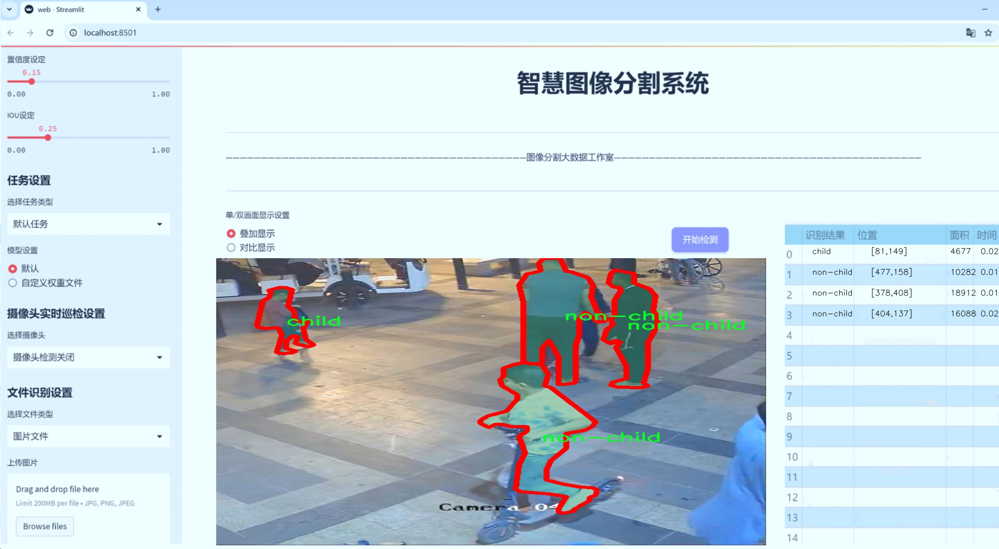
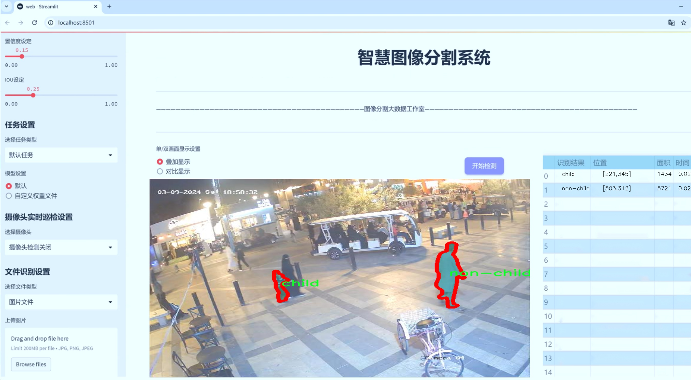
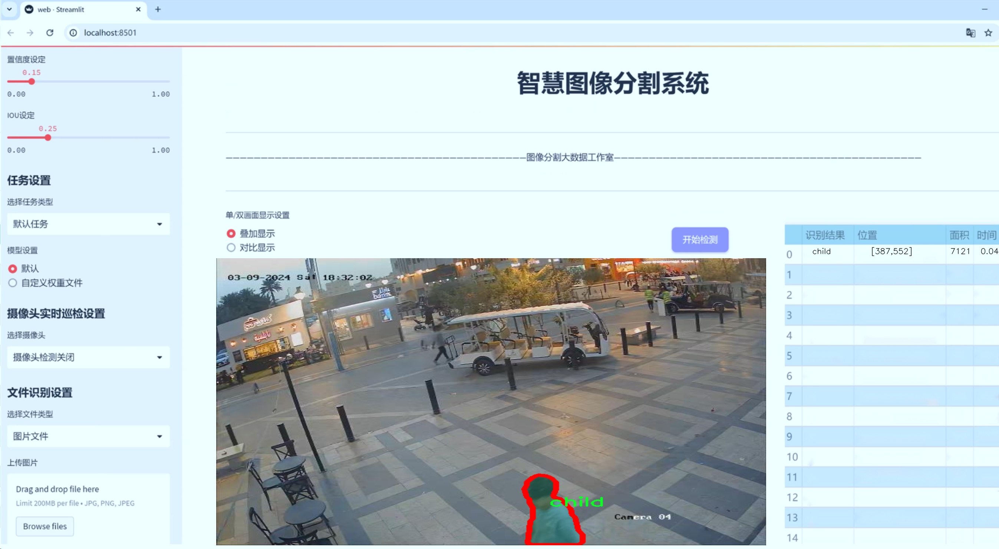
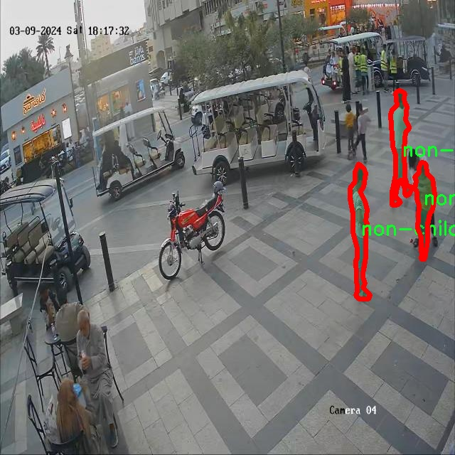
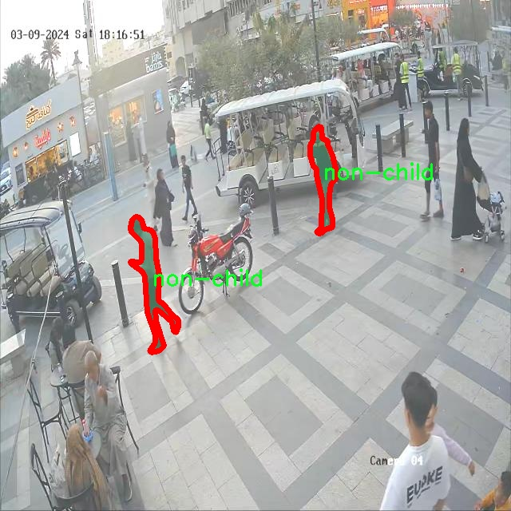
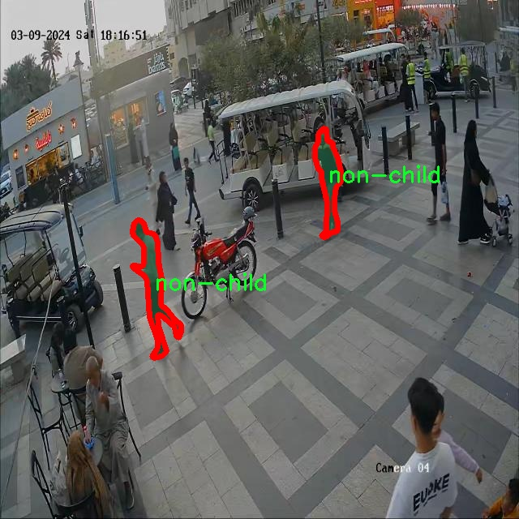
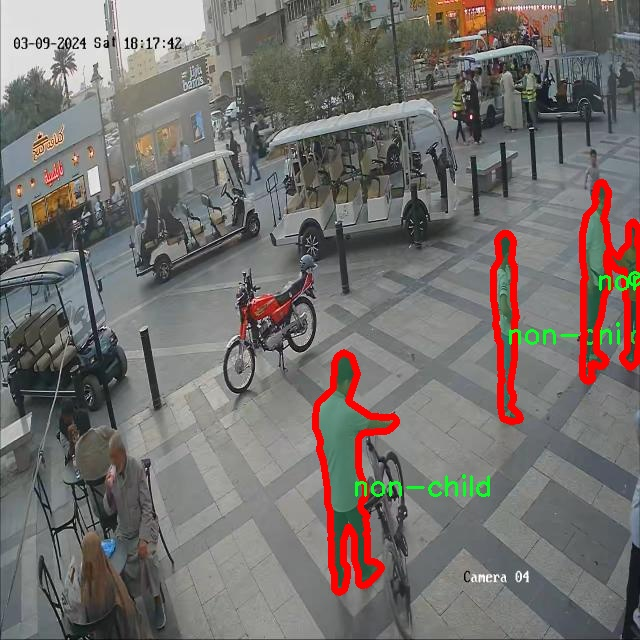
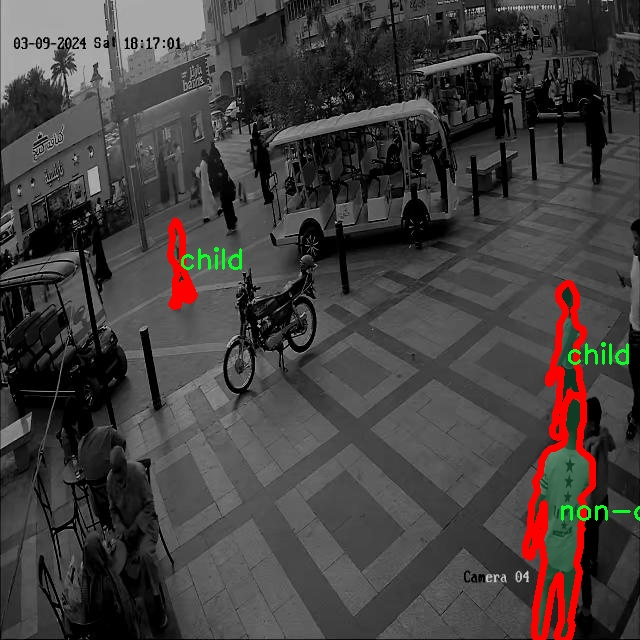

# 儿童与成年人识别图像分割系统源码＆数据集分享
 [yolov8-seg-SPPF-LSKA＆yolov8-seg-SPDConv等50+全套改进创新点发刊_一键训练教程_Web前端展示]

### 1.研究背景与意义

项目参考[ILSVRC ImageNet Large Scale Visual Recognition Challenge](https://gitee.com/YOLOv8_YOLOv11_Segmentation_Studio/projects)

项目来源[AAAI Global Al lnnovation Contest](https://kdocs.cn/l/cszuIiCKVNis)

研究背景与意义

随着计算机视觉技术的快速发展，图像分割作为其重要分支之一，已广泛应用于各个领域，包括医疗影像分析、自动驾驶、安防监控等。在这些应用中，准确识别和分割目标对象的能力直接影响到系统的性能和应用效果。近年来，YOLO（You Only Look Once）系列模型因其高效的实时检测能力而受到广泛关注，尤其是YOLOv8的推出，进一步提升了目标检测和分割的精度与速度。然而，针对特定人群（如儿童与成年人）的图像分割任务仍然面临诸多挑战，尤其是在复杂环境下的准确性和鲁棒性。

儿童与成年人在外观特征上的差异，使得基于深度学习的图像分割系统在处理这两类对象时，必须具备更高的辨识能力。儿童通常体型较小，面部特征和身体比例与成年人有显著不同，这为图像分割算法的设计提出了更高的要求。通过改进YOLOv8模型，结合针对儿童与成年人识别的特定数据集，可以有效提升模型在这两类对象上的分割精度。我们所使用的数据集包含1100张图像，分为儿童和非儿童两类，具有较强的代表性和多样性，为模型的训练和验证提供了坚实的基础。

本研究的意义在于，通过构建一个基于改进YOLOv8的儿童与成年人识别图像分割系统，不仅可以提升图像分割的准确性，还能为相关领域的应用提供新的思路和方法。例如，在智能监控系统中，能够实时识别和分割儿童与成年人，有助于提高公共安全管理的效率；在医疗领域，准确识别儿童患者的影像数据，有助于医生做出更为精准的诊断和治疗方案。此外，该系统的研究成果还可以为人机交互、教育科技等领域提供支持，推动智能技术在社会生活中的广泛应用。

通过对YOLOv8模型的改进，我们期望在模型的结构、损失函数、数据增强等方面进行创新，以提高其在儿童与成年人识别任务中的表现。这不仅有助于推动图像分割技术的发展，也为未来的研究提供了新的方向。综上所述，本研究不仅具有重要的理论价值，也具备广泛的实际应用前景，为相关领域的研究者和从业者提供了有力的工具和参考。

### 2.图片演示







##### 注意：由于此博客编辑较早，上面“2.图片演示”和“3.视频演示”展示的系统图片或者视频可能为老版本，新版本在老版本的基础上升级如下：（实际效果以升级的新版本为准）

  （1）适配了YOLOV8的“目标检测”模型和“实例分割”模型，通过加载相应的权重（.pt）文件即可自适应加载模型。

  （2）支持“图片识别”、“视频识别”、“摄像头实时识别”三种识别模式。

  （3）支持“图片识别”、“视频识别”、“摄像头实时识别”三种识别结果保存导出，解决手动导出（容易卡顿出现爆内存）存在的问题，识别完自动保存结果并导出到tempDir中。

  （4）支持Web前端系统中的标题、背景图等自定义修改，后面提供修改教程。

  另外本项目提供训练的数据集和训练教程,暂不提供权重文件（best.pt）,需要您按照教程进行训练后实现图片演示和Web前端界面演示的效果。

### 3.视频演示

[3.1 视频演示](https://www.bilibili.com/video/BV1GG1PYnEdZ/)

### 4.数据集信息展示

##### 4.1 本项目数据集详细数据（类别数＆类别名）

nc: 2
names: ['child', 'non-child']


##### 4.2 本项目数据集信息介绍

数据集信息展示

在本研究中，我们采用了名为“mgp2”的数据集，以训练和改进YOLOv8-seg模型，旨在实现儿童与成年人图像的精确识别与分割。该数据集专注于两个主要类别，分别为“child”（儿童）和“non-child”（非儿童），共计包含两个类别（nc: 2）。这一设计使得模型能够有效地区分儿童与成年人，进而提升图像分割的准确性和效率。

“mgp2”数据集的构建过程充分考虑了现实世界中的多样性与复杂性，确保所收集的图像能够涵盖不同年龄段、性别、种族及环境背景的儿童与成年人。这种多样性不仅增强了模型的泛化能力，也使得其在实际应用中更具实用性。数据集中包含的图像均经过精心标注，确保每一张图像中的目标对象（儿童或非儿童）都能被准确识别并分割。这种高质量的标注为后续的模型训练提供了坚实的基础。

在数据集的构成上，“mgp2”不仅包含了日常生活场景中的儿童与成年人图像，还包括了不同活动状态下的图像，例如玩耍、学习、社交等。这种多样化的场景设置使得模型能够学习到不同情况下儿童与成年人之间的显著特征，从而在实际应用中能够更好地应对各种复杂的环境和情境。此外，数据集还考虑到了不同光照条件和天气变化对图像质量的影响，确保模型在各种环境下均能保持良好的识别性能。

为了提高模型的鲁棒性，数据集还进行了数据增强处理，包括随机裁剪、旋转、翻转、颜色变换等。这些技术手段不仅增加了数据集的有效样本数量，还帮助模型学习到更为丰富的特征，从而在面对未知数据时能够做出更为准确的判断。通过这些精心设计的步骤，“mgp2”数据集为YOLOv8-seg模型的训练提供了强有力的支持。

在训练过程中，我们将数据集划分为训练集、验证集和测试集，以确保模型在不同阶段的学习效果和评估标准。训练集用于模型的参数学习，验证集用于调优模型超参数，而测试集则用于最终的性能评估。这种科学的划分方式能够有效避免模型的过拟合现象，确保其在真实场景中的应用效果。

综上所述，“mgp2”数据集不仅为儿童与成年人识别图像分割系统的训练提供了丰富而多样的样本，还通过精细的标注和合理的数据增强策略，确保了模型的高效性和准确性。通过对该数据集的深入研究与应用，我们期望能够在儿童与成年人识别领域取得显著的进展，为相关的社会应用提供有力的技术支持。











### 5.全套项目环境部署视频教程（零基础手把手教学）

[5.1 环境部署教程链接（零基础手把手教学）](https://www.bilibili.com/video/BV1jG4Ve4E9t/?vd_source=bc9aec86d164b67a7004b996143742dc)


[5.2 安装Python虚拟环境创建和依赖库安装视频教程链接（零基础手把手教学）](https://www.bilibili.com/video/BV1nA4VeYEze/?vd_source=bc9aec86d164b67a7004b996143742dc)

### 6.手把手YOLOV8-seg训练视频教程（零基础小白有手就能学会）

[6.1 手把手YOLOV8-seg训练视频教程（零基础小白有手就能学会）](https://www.bilibili.com/video/BV1cA4VeYETe/?vd_source=bc9aec86d164b67a7004b996143742dc)


按照上面的训练视频教程链接加载项目提供的数据集，运行train.py即可开始训练



     Epoch   gpu_mem       box       obj       cls    labels  img_size
     1/200     0G   0.01576   0.01955  0.007536        22      1280: 100%|██████████| 849/849 [14:42<00:00,  1.04s/it]
               Class     Images     Labels          P          R     mAP@.5 mAP@.5:.95: 100%|██████████| 213/213 [01:14<00:00,  2.87it/s]
                 all       3395      17314      0.994      0.957      0.0957      0.0843

     Epoch   gpu_mem       box       obj       cls    labels  img_size
     2/200     0G   0.01578   0.01923  0.007006        22      1280: 100%|██████████| 849/849 [14:44<00:00,  1.04s/it]
               Class     Images     Labels          P          R     mAP@.5 mAP@.5:.95: 100%|██████████| 213/213 [01:12<00:00,  2.95it/s]
                 all       3395      17314      0.996      0.956      0.0957      0.0845

     Epoch   gpu_mem       box       obj       cls    labels  img_size
     3/200     0G   0.01561    0.0191  0.006895        27      1280: 100%|██████████| 849/849 [10:56<00:00,  1.29it/s]
               Class     Images     Labels          P          R     mAP@.5 mAP@.5:.95: 100%|███████   | 187/213 [00:52<00:00,  4.04it/s]
                 all       3395      17314      0.996      0.957      0.0957      0.0845


### 7.50+种全套YOLOV8-seg创新点代码加载调参视频教程（一键加载写好的改进模型的配置文件）

[7.1 50+种全套YOLOV8-seg创新点代码加载调参视频教程（一键加载写好的改进模型的配置文件）](https://www.bilibili.com/video/BV1Hw4VePEXv/?vd_source=bc9aec86d164b67a7004b996143742dc)

### 8.YOLOV8-seg图像分割算法原理

原始YOLOv8-seg算法原理

YOLOv8-seg算法是YOLO系列中的最新版本，结合了目标检测与实例分割的任务，展现出强大的性能和灵活性。作为一种一阶段目标检测算法，YOLOv8-seg在设计上充分考虑了实时性与准确性，致力于在各种复杂场景中实现高效的目标识别与分割。该算法的核心在于其独特的网络结构与创新的训练策略，使其在计算机视觉领域中脱颖而出。

YOLOv8-seg的网络结构主要由三个部分组成：主干网络（Backbone）、特征增强网络（Neck）和检测头（Head）。在主干网络中，YOLOv8-seg依然延续了CSP（Cross Stage Partial）网络的设计理念，通过引入C2模块和改进的卷积层结构，提升了特征提取的效率与效果。C2模块的使用不仅增强了网络的表达能力，还通过跳层连接的方式有效缓解了深层网络中的梯度消失问题。这种设计使得YOLOv8-seg能够在处理高分辨率图像时，保持较高的检测精度。

特征增强网络采用了PAN-FPN（Path Aggregation Network - Feature Pyramid Network）的思想，旨在实现多尺度特征的有效融合。通过对来自不同层次的特征图进行整合，YOLOv8-seg能够更好地捕捉到不同尺度目标的信息，从而提高了模型在复杂场景下的鲁棒性。这种特征融合策略使得算法在处理小目标和大目标时都能保持较高的准确率，尤其是在分割任务中，能够更精确地 delineate 目标边界。

在检测头部分，YOLOv8-seg采用了解耦头的设计，将目标分类与位置回归任务分开处理。这一创新的设计理念使得模型能够更加专注于各自的任务，减少了任务间的干扰，从而提高了定位精度和分类准确性。通过解耦设计，YOLOv8-seg能够有效地应对复杂场景下的目标检测与分割问题，尤其是在目标重叠或背景复杂的情况下，表现出色。

YOLOv8-seg还引入了Anchor-free目标检测方法，这一方法的核心在于直接预测目标的位置与大小，而不依赖于预定义的锚点框。这一创新的回归方式不仅简化了模型的设计，还提高了检测速度，使得网络能够更快地聚焦于目标位置的邻近点，进而生成更接近实际边界框的预测结果。这种Anchor-free的设计理念，尤其适用于多样化的目标形状与尺度，增强了模型的适应性。

在损失函数的设计上，YOLOv8-seg也进行了重要的改进，采用了更为复杂的损失计算方式，以更好地平衡分类与回归任务的损失。这种损失函数的设计旨在提升模型的训练效果，使得YOLOv8-seg在不同任务间的性能更加均衡。通过对损失函数的优化，YOLOv8-seg能够在训练过程中更有效地调整权重，从而提高模型的整体性能。

此外，YOLOv8-seg在模型的轻量化方面也取得了显著进展。相较于之前的YOLO系列，YOLOv8-seg的权重文件进一步减小，使得该模型能够在各种嵌入式设备上进行高效部署。这一特性使得YOLOv8-seg在实时检测与分割任务中表现尤为突出，能够满足对计算资源要求较低的应用场景。

综上所述，YOLOv8-seg算法通过其独特的网络结构、创新的特征融合策略、解耦的检测头设计以及Anchor-free的目标检测方法，展现出强大的目标检测与实例分割能力。无论是在精度、速度还是在适应性方面，YOLOv8-seg都表现出色，成为计算机视觉领域中一种极具潜力的解决方案。随着YOLOv8-seg的不断发展与应用，其在实际场景中的表现将进一步推动目标检测与分割技术的进步，为各类智能应用提供更为可靠的技术支持。


### 9.系统功能展示（检测对象为举例，实际内容以本项目数据集为准）

图9.1.系统支持检测结果表格显示

  图9.2.系统支持置信度和IOU阈值手动调节

  图9.3.系统支持自定义加载权重文件best.pt(需要你通过步骤5中训练获得)

  图9.4.系统支持摄像头实时识别

  图9.5.系统支持图片识别

  图9.6.系统支持视频识别

  图9.7.系统支持识别结果文件自动保存

  图9.8.系统支持Excel导出检测结果数据


### 10.50+种全套YOLOV8-seg创新点原理讲解（非科班也可以轻松写刊发刊，V11版本正在科研待更新）

#### 10.1 由于篇幅限制，每个创新点的具体原理讲解就不一一展开，具体见下列网址中的创新点对应子项目的技术原理博客网址【Blog】：


[10.1 50+种全套YOLOV8-seg创新点原理讲解链接](https://gitee.com/qunmasj/good)

#### 10.2 部分改进模块原理讲解(完整的改进原理见上图和技术博客链接)【如果此小节的图加载失败可以通过CSDN或者Github搜索该博客的标题访问原始博客，原始博客图片显示正常】
### YOLOv8简介
#### Neck模块设计
骨干网络和 Neck 的具体变化为：

第一个卷积层的 kernel 从 6x6 变成了 3x3
所有的 C3 模块换成 C2f，结构如下所示，可以发现多了更多的跳层连接和额外的 Split 操作


去掉了 Neck 模块中的 2 个卷积连接层
Backbone 中 C2f 的 block 数从 3-6-9-3 改成了 3-6-6-3
查看 N/S/M/L/X 等不同大小模型，可以发现 N/S 和 L/X 两组模型只是改了缩放系数，但是 S/M/L 等骨干网络的通道数设置不一样，没有遵循同一套缩放系数。如此设计的原因应该是同一套缩放系数下的通道设置不是最优设计，YOLOv7 网络设计时也没有遵循一套缩放系数作用于所有模型。

#### Head模块设计
Head 部分变化最大，从原先的耦合头变成了解耦头，并且从 YOLOv5 的 Anchor-Based 变成了 Anchor-Free。其结构如下所示：


可以看出，不再有之前的 objectness 分支，只有解耦的分类和回归分支，并且其回归分支使用了 Distribution Focal Loss 中提出的积分形式表示法。

#### Loss 计算
Loss 计算过程包括 2 个部分： 正负样本分配策略和 Loss 计算。 现代目标检测器大部分都会在正负样本分配策略上面做文章，典型的如 YOLOX 的 simOTA、TOOD 的 TaskAlignedAssigner 和 RTMDet 的 DynamicSoftLabelAssigner，这类 Assigner 大都是动态分配策略，而 YOLOv5 采用的依然是静态分配策略。考虑到动态分配策略的优异性，YOLOv8 算法中则直接引用了 TOOD 的 TaskAlignedAssigner。 TaskAlignedAssigner 的匹配策略简单总结为： 根据分类与回归的分数加权的分数选择正样本。

s 是标注类别对应的预测分值，u 是预测框和 gt 框的 iou，两者相乘就可以衡量对齐程度。

对于每一个 GT，对所有的预测框基于 GT 类别对应分类分数，预测框与 GT 的 IoU 的加权得到一个关联分类以及回归的对齐分数 alignment_metrics 。
对于每一个 GT，直接基于 alignment_metrics 对齐分数选取 topK 大的作为正样本
Loss 计算包括 2 个分支： 分类和回归分支，没有了之前的 objectness 分支。
分类分支依然采用 BCE Loss
回归分支需要和 Distribution Focal Loss 中提出的积分形式表示法绑定，因此使用了 Distribution Focal Loss， 同时还使用了 CIoU Loss
Loss 采用一定权重比例加权即可。
#### 训练数据增强
数据增强方面和 YOLOv5 差距不大，只不过引入了 YOLOX 中提出的最后 10 个 epoch 关闭 Mosaic 的操作。假设训练 epoch 是 500，其示意图如下所示：

### RCS-OSA的基本原理
参考该博客，RCSOSA（RCS-One-Shot Aggregation）是RCS-YOLO中提出的一种结构，我们可以将主要原理概括如下：

1. RCS（Reparameterized Convolution based on channel Shuffle）: 结合了通道混洗，通过重参数化卷积来增强网络的特征提取能力。

2. RCS模块: 在训练阶段，利用多分支结构学习丰富的特征表示；在推理阶段，通过结构化重参数化简化为单一分支，减少内存消耗。

3. OSA（One-Shot Aggregation）: 一次性聚合多个特征级联，减少网络计算负担，提高计算效率。

4. 特征级联: RCS-OSA模块通过堆叠RCS，确保特征的复用并加强不同层之间的信息流动。

#### RCS
RCS（基于通道Shuffle的重参数化卷积）是RCS-YOLO的核心组成部分，旨在训练阶段通过多分支结构学习丰富的特征信息，并在推理阶段通过简化为单分支结构来减少内存消耗，实现快速推理。此外，RCS利用通道分割和通道Shuffle操作来降低计算复杂性，同时保持通道间的信息交换，这样在推理阶段相比普通的3×3卷积可以减少一半的计算复杂度。通过结构重参数化，RCS能够在训练阶段从输入特征中学习深层表示，并在推理阶段实现快速推理，同时减少内存消耗。

#### RCS模块
RCS（基于通道Shuffle的重参数化卷积）模块中，结构在训练阶段使用多个分支，包括1x1和3x3的卷积，以及一个直接的连接（Identity），用于学习丰富的特征表示。在推理阶段，结构被重参数化成一个单一的3x3卷积，以减少计算复杂性和内存消耗，同时保持训练阶段学到的特征表达能力。这与RCS的设计理念紧密相连，即在不牺牲性能的情况下提高计算效率。


上图为大家展示了RCS的结构，分为训练阶段（a部分）和推理阶段（b部分）。在训练阶段，输入通过通道分割，一部分输入经过RepVGG块，另一部分保持不变。然后通过1x1卷积和3x3卷积处理RepVGG块的输出，与另一部分输入进行通道Shuffle和连接。在推理阶段，原来的多分支结构被简化为一个单一的3x3 RepConv块。这种设计允许在训练时学习复杂特征，在推理时减少计算复杂度。黑色边框的矩形代表特定的模块操作，渐变色的矩形代表张量的特定特征，矩形的宽度代表张量的通道数。 

#### OSA
OSA（One-Shot Aggregation）是一个关键的模块，旨在提高网络在处理密集连接时的效率。OSA模块通过表示具有多个感受野的多样化特征，并在最后的特征映射中仅聚合一次所有特征，从而克服了DenseNet中密集连接的低效率问题。

OSA模块的使用有两个主要目的：

1. 提高特征表示的多样性：OSA通过聚合具有不同感受野的特征来增加网络对于不同尺度的敏感性，这有助于提升模型对不同大小目标的检测能力。

2. 提高效率：通过在网络的最后一部分只进行一次特征聚合，OSA减少了重复的特征计算和存储需求，从而提高了网络的计算和能源效率。

在RCS-YOLO中，OSA模块被进一步与RCS（基于通道Shuffle的重参数化卷积）相结合，形成RCS-OSA模块。这种结合不仅保持了低成本的内存消耗，而且还实现了语义信息的有效提取，对于构建轻量级和大规模的对象检测器尤为重要。

下面我将为大家展示RCS-OSA（One-Shot Aggregation of RCS）的结构。


在RCS-OSA模块中，输入被分为两部分，一部分直接通过，另一部分通过堆叠的RCS模块进行处理。处理后的特征和直接通过的特征在通道混洗（Channel Shuffle）后合并。这种结构设计用于增强模型的特征提取和利用效率，是RCS-YOLO架构中的一个关键组成部分旨在通过一次性聚合来提高模型处理特征的能力，同时保持计算效率。

#### 特征级联
特征级联（feature cascade）是一种技术，通过在网络的一次性聚合（one-shot aggregate）路径上维持有限数量的特征级联来实现的。在RCS-YOLO中，特别是在RCS-OSA（RCS-Based One-Shot Aggregation）模块中，只保留了三个特征级联。

特征级联的目的是为了减轻网络计算负担并降低内存占用。这种方法可以有效地聚合不同层次的特征，提高模型的语义信息提取能力，同时避免了过度复杂化网络结构所带来的低效率和高资源消耗。

下面为大家提供的图像展示的是RCS-YOLO的整体架构，其中包括RCS-OSA模块。RCS-OSA在模型中用于堆叠RCS模块，以确保特征的复用并加强不同层之间的信息流动。图中显示的多层RCS-OSA模块的排列和组合反映了它们如何一起工作以优化特征传递和提高检测性能。


总结：RCS-YOLO主要由RCS-OSA（蓝色模块）和RepVGG（橙色模块）构成。这里的n代表堆叠RCS模块的数量。n_cls代表检测到的对象中的类别数量。图中的IDetect是从YOLOv7中借鉴过来的，表示使用二维卷积神经网络的检测层。这个架构通过堆叠的RCS模块和RepVGG模块，以及两种类型的检测层，实现了对象检测的任务。 


### 11.项目核心源码讲解（再也不用担心看不懂代码逻辑）

#### 11.1 ui.py

以下是经过精简和注释的核心代码部分：

```python
import sys
import subprocess
from QtFusion.path import abs_path

def run_script(script_path):
    """
    使用当前 Python 环境运行指定的脚本。

    Args:
        script_path (str): 要运行的脚本路径
    """
    # 获取当前 Python 解释器的路径
    python_path = sys.executable

    # 构建运行命令，使用 streamlit 运行指定的脚本
    command = f'"{python_path}" -m streamlit run "{script_path}"'

    # 执行命令，并检查返回状态
    result = subprocess.run(command, shell=True)
    if result.returncode != 0:
        print("脚本运行出错。")

# 主程序入口
if __name__ == "__main__":
    # 获取脚本的绝对路径
    script_path = abs_path("web.py")

    # 运行指定的脚本
    run_script(script_path)
```

### 代码详细注释：
1. **导入模块**：
   - `sys`：用于访问与 Python 解释器紧密相关的变量和函数。
   - `subprocess`：用于执行外部命令和管理子进程。
   - `abs_path`：从 `QtFusion.path` 模块导入的函数，用于获取文件的绝对路径。

2. **`run_script` 函数**：
   - **参数**：接收一个字符串类型的参数 `script_path`，表示要运行的 Python 脚本的路径。
   - **功能**：构建并执行一个命令来运行指定的 Python 脚本，使用 `streamlit` 模块。

3. **获取 Python 解释器路径**：
   - 使用 `sys.executable` 获取当前 Python 解释器的完整路径，以确保在正确的环境中运行脚本。

4. **构建命令**：
   - 使用格式化字符串构建命令，确保命令的正确性和安全性。

5. **执行命令**：
   - 使用 `subprocess.run` 执行构建的命令，并通过 `shell=True` 允许在 shell 中执行。
   - 检查命令的返回状态，如果返回码不为 0，表示执行出错，打印错误信息。

6. **主程序入口**：
   - 检查 `__name__` 是否为 `"__main__"`，确保该代码块仅在直接运行脚本时执行。
   - 调用 `abs_path` 函数获取 `web.py` 的绝对路径，并传递给 `run_script` 函数以执行该脚本。

这个文件名为 `ui.py`，它的主要功能是运行一个指定的 Python 脚本，具体来说是使用 Streamlit 框架来启动一个 Web 应用。

首先，文件中导入了一些必要的模块，包括 `sys`、`os` 和 `subprocess`。其中，`sys` 模块用于访问与 Python 解释器相关的变量和函数，`os` 模块提供了与操作系统交互的功能，而 `subprocess` 模块则用于创建新进程、连接到它们的输入/输出/错误管道，并获取它们的返回码。

接下来，文件中定义了一个名为 `run_script` 的函数。这个函数接收一个参数 `script_path`，表示要运行的脚本的路径。函数内部首先获取当前 Python 解释器的路径，并将其存储在 `python_path` 变量中。然后，构建一个命令字符串，使用 Streamlit 运行指定的脚本。这个命令字符串的格式是 `"{python_path}" -m streamlit run "{script_path}"`，其中 `{python_path}` 和 `{script_path}` 分别被替换为实际的 Python 解释器路径和脚本路径。

接着，使用 `subprocess.run` 方法执行这个命令。该方法的 `shell=True` 参数表示在 shell 中执行命令。执行后，函数检查返回码，如果返回码不为 0，表示脚本运行出错，程序会打印出“脚本运行出错。”的提示信息。

在文件的最后部分，使用 `if __name__ == "__main__":` 语句来确保只有在直接运行该脚本时才会执行以下代码。这里指定了要运行的脚本路径，调用了 `abs_path` 函数来获取 `web.py` 的绝对路径。最后，调用 `run_script` 函数来执行这个脚本。

总的来说，这个文件的作用是通过指定的 Python 解释器来运行一个 Streamlit 应用脚本，提供了一种方便的方式来启动 Web 应用。

#### 11.2 ultralytics\hub\session.py

以下是经过简化和注释的核心代码部分：

```python
import signal
import sys
from time import sleep
import requests
from ultralytics.hub.utils import HUB_API_ROOT, HUB_WEB_ROOT, smart_request
from ultralytics.utils import LOGGER, checks
from ultralytics.utils.errors import HUBModelError

class HUBTrainingSession:
    """
    Ultralytics HUB YOLO模型的训练会话，负责模型初始化、心跳检测和检查点上传。
    """

    def __init__(self, url):
        """
        使用提供的模型标识符初始化HUBTrainingSession。

        参数:
            url (str): 用于初始化HUB训练会话的模型标识符，可以是URL字符串或特定格式的模型键。
        """
        # 解析输入的模型URL
        if url.startswith(f'{HUB_WEB_ROOT}/models/'):
            url = url.split(f'{HUB_WEB_ROOT}/models/')[-1]
        if [len(x) for x in url.split('_')] == [42, 20]:
            key, model_id = url.split('_')  # 从URL中提取key和model_id
        elif len(url) == 20:
            key, model_id = '', url  # 仅有model_id
        else:
            raise HUBModelError(f"model='{url}' not found. 请检查格式是否正确。")

        # 授权
        auth = Auth(key)
        self.model_id = model_id
        self.model_url = f'{HUB_WEB_ROOT}/models/{model_id}'
        self.api_url = f'{HUB_API_ROOT}/v1/models/{model_id}'
        self.auth_header = auth.get_auth_header()  # 获取认证头
        self.metrics_queue = {}  # 存储模型的指标
        self.model = self._get_model()  # 获取模型数据
        self.alive = True  # 心跳状态
        self._start_heartbeat()  # 启动心跳检测
        self._register_signal_handlers()  # 注册信号处理器
        LOGGER.info(f'查看模型: {self.model_url} 🚀')

    def _register_signal_handlers(self):
        """注册信号处理器以优雅地处理终止信号。"""
        signal.signal(signal.SIGTERM, self._handle_signal)
        signal.signal(signal.SIGINT, self._handle_signal)

    def _handle_signal(self, signum, frame):
        """处理终止信号，停止心跳检测。"""
        if self.alive:
            LOGGER.info('接收到终止信号! ❌')
            self._stop_heartbeat()
            sys.exit(signum)

    def _stop_heartbeat(self):
        """终止心跳检测循环。"""
        self.alive = False

    def upload_metrics(self):
        """上传模型指标到Ultralytics HUB。"""
        payload = {'metrics': self.metrics_queue.copy(), 'type': 'metrics'}
        smart_request('post', self.api_url, json=payload, headers=self.auth_header)

    def _get_model(self):
        """从Ultralytics HUB获取并返回模型数据。"""
        api_url = f'{HUB_API_ROOT}/v1/models/{self.model_id}'
        try:
            response = smart_request('get', api_url, headers=self.auth_header)
            data = response.json().get('data', None)

            if data.get('status') == 'trained':
                raise ValueError('模型已训练并上传。')

            if not data.get('data'):
                raise ValueError('数据集可能仍在处理，请稍等。')

            self.model_id = data['id']  # 更新模型ID
            return data
        except requests.exceptions.ConnectionError:
            raise ConnectionRefusedError('错误: HUB服务器未在线，请稍后再试。')

    def upload_model(self, epoch, weights, is_best=False, final=False):
        """
        上传模型检查点到Ultralytics HUB。

        参数:
            epoch (int): 当前训练的epoch。
            weights (str): 模型权重文件的路径。
            is_best (bool): 当前模型是否为最佳模型。
            final (bool): 当前模型是否为最终模型。
        """
        if Path(weights).is_file():
            with open(weights, 'rb') as f:
                file = f.read()  # 读取权重文件
        else:
            LOGGER.warning(f'模型上传问题，缺少模型 {weights}.')
            file = None

        url = f'{self.api_url}/upload'
        data = {'epoch': epoch}
        if final:
            data.update({'type': 'final'})
            smart_request('post', url, data=data, files={'final_model.pt': file}, headers=self.auth_header)
        else:
            data.update({'type': 'epoch', 'isBest': is_best})
            smart_request('post', url, data=data, files={'last.pt': file}, headers=self.auth_header)

    def _start_heartbeat(self):
        """开始一个线程心跳循环，报告代理的状态到Ultralytics HUB。"""
        while self.alive:
            smart_request('post', f'{HUB_API_ROOT}/v1/agent/heartbeat/models/{self.model_id}',
                          json={'agent': AGENT_NAME}, headers=self.auth_header)
            sleep(300)  # 每300秒发送一次心跳
```

### 代码说明：
1. **HUBTrainingSession类**：该类用于管理Ultralytics HUB YOLO模型的训练会话，包括模型的初始化、心跳检测和指标上传等功能。
2. **__init__方法**：初始化会话，解析模型标识符，进行授权，并启动心跳检测。
3. **_register_signal_handlers方法**：注册信号处理器，以便在接收到终止信号时优雅地停止心跳检测。
4. **upload_metrics方法**：将模型的指标上传到Ultralytics HUB。
5. **_get_model方法**：从Ultralytics HUB获取模型数据，处理不同的模型状态。
6. **upload_model方法**：上传模型的检查点，包括当前的权重文件。
7. **_start_heartbeat方法**：在一个线程中定期发送心跳请求，报告代理的状态。

这个程序文件定义了一个名为 `HUBTrainingSession` 的类，主要用于管理 Ultralytics HUB 上 YOLO 模型的训练会话。该类负责模型的初始化、心跳信号的发送以及检查点的上传等功能。

在类的初始化方法 `__init__` 中，首先会解析传入的模型标识符 `url`，如果该标识符是一个有效的模型 URL，程序会提取出模型的关键字和 ID。如果格式不正确，则会抛出一个 `HUBModelError` 异常。接着，程序会进行身份验证，并设置一些基本的属性，包括模型的 URL、API URL、身份验证头、速率限制、定时器、模型数据队列等。最后，程序会启动心跳机制以定期向服务器报告状态，并注册信号处理器以优雅地处理终止信号。

信号处理器 `_register_signal_handlers` 和 `_handle_signal` 方法用于捕获系统终止信号（如 SIGTERM 和 SIGINT），在接收到这些信号时，会停止心跳并退出程序。

`upload_metrics` 方法用于将模型的性能指标上传到 Ultralytics HUB。它会将当前的指标队列作为负载发送到 API。

`_get_model` 方法用于从 Ultralytics HUB 获取模型数据。它会检查模型的状态，如果模型已经训练完成，则会抛出异常。如果模型是新的，则会提取训练参数；如果模型正在训练，则会准备恢复训练的参数。

`upload_model` 方法用于将模型的检查点上传到 Ultralytics HUB。根据当前的训练状态和参数，它会将模型权重文件和相关信息上传到服务器。

最后，`_start_heartbeat` 方法会在一个独立的线程中运行，定期向 Ultralytics HUB 发送心跳信号，报告代理的状态。这是通过发送 POST 请求实现的，确保服务器能够跟踪当前训练会话的状态。

总体来说，这个类的设计目的是为了简化与 Ultralytics HUB 的交互，使得用户能够方便地管理和监控 YOLO 模型的训练过程。

#### 11.3 ultralytics\nn\extra_modules\ops_dcnv3\setup.py

以下是代码中最核心的部分，并附上详细的中文注释：

```python
import os
import glob
import torch
from torch.utils.cpp_extension import CUDA_HOME, CppExtension, CUDAExtension
from setuptools import find_packages, setup

# 定义所需的依赖包
requirements = ["torch", "torchvision"]

def get_extensions():
    # 获取当前文件的目录
    this_dir = os.path.dirname(os.path.abspath(__file__))
    # 定义扩展模块的源代码目录
    extensions_dir = os.path.join(this_dir, "src")

    # 查找主文件和CPU、CUDA源文件
    main_file = glob.glob(os.path.join(extensions_dir, "*.cpp"))
    source_cpu = glob.glob(os.path.join(extensions_dir, "cpu", "*.cpp"))
    source_cuda = glob.glob(os.path.join(extensions_dir, "cuda", "*.cu"))

    # 合并源文件
    sources = main_file + source_cpu
    extension = CppExtension  # 默认使用 CppExtension
    extra_compile_args = {"cxx": []}  # 编译参数
    define_macros = []  # 宏定义

    # 检查是否可以使用CUDA
    if torch.cuda.is_available() and CUDA_HOME is not None:
        extension = CUDAExtension  # 使用 CUDAExtension
        sources += source_cuda  # 添加CUDA源文件
        define_macros += [("WITH_CUDA", None)]  # 定义WITH_CUDA宏
        extra_compile_args["nvcc"] = []  # NVCC编译参数（可根据需要添加）
    else:
        raise NotImplementedError('Cuda is not available')  # 如果没有CUDA，抛出异常

    # 生成完整的源文件路径
    sources = [os.path.join(extensions_dir, s) for s in sources]
    include_dirs = [extensions_dir]  # 包含目录

    # 创建扩展模块
    ext_modules = [
        extension(
            "DCNv3",  # 模块名称
            sources,  # 源文件列表
            include_dirs=include_dirs,  # 包含目录
            define_macros=define_macros,  # 宏定义
            extra_compile_args=extra_compile_args,  # 编译参数
        )
    ]
    return ext_modules  # 返回扩展模块列表

# 使用setuptools设置包信息
setup(
    name="DCNv3",  # 包名称
    version="1.1",  # 版本号
    author="InternImage",  # 作者
    url="https://github.com/OpenGVLab/InternImage",  # 项目链接
    description="PyTorch Wrapper for CUDA Functions of DCNv3",  # 描述
    packages=find_packages(exclude=("configs", "tests")),  # 查找包，排除configs和tests目录
    ext_modules=get_extensions(),  # 获取扩展模块
    cmdclass={"build_ext": torch.utils.cpp_extension.BuildExtension},  # 自定义构建扩展的命令类
)
```

### 代码核心部分说明：
1. **导入模块**：导入必要的库和模块，包括操作系统、文件查找、PyTorch及其扩展工具，以及setuptools。
2. **获取扩展函数**：`get_extensions`函数负责查找源文件，判断CUDA的可用性，并创建相应的扩展模块。
3. **源文件查找**：使用`glob`模块查找指定目录下的源文件，包括CPU和CUDA的实现。
4. **CUDA支持检查**：判断当前环境是否支持CUDA，如果不支持则抛出异常。
5. **设置扩展模块**：使用`setuptools`的`setup`函数定义包的基本信息，并将扩展模块添加到包中。

这个 `setup.py` 文件是用于配置和安装一个名为 DCNv3 的 Python 包，该包是一个 PyTorch 的扩展，主要用于支持 CUDA 功能。文件开头包含了一些版权信息和许可证声明，接着导入了必要的模块。

首先，导入了 `os` 和 `glob` 模块，用于文件和目录的操作。然后，导入了 PyTorch 相关的模块，包括 `CUDA_HOME`、`CppExtension` 和 `CUDAExtension`，这些都是用于编译 C++ 和 CUDA 代码的工具。接着，定义了一个 `requirements` 列表，指定了该包所依赖的库，即 `torch` 和 `torchvision`。

接下来，定义了一个 `get_extensions` 函数，该函数用于获取需要编译的扩展模块。首先，它获取当前文件的目录，并构建了源代码的路径。通过 `glob` 模块，查找指定目录下的 C++ 和 CUDA 源文件。

在这个函数中，首先将主文件和 CPU 源文件添加到 `sources` 列表中。接着，检查是否可以使用 CUDA，如果可以，则将扩展类型设置为 `CUDAExtension`，并将 CUDA 源文件添加到 `sources` 列表中，同时定义了一个宏 `WITH_CUDA`。如果 CUDA 不可用，则抛出一个 `NotImplementedError` 异常。

然后，所有的源文件路径被整理为绝对路径，并指定了包含目录。接着，创建了一个扩展模块的列表 `ext_modules`，其中包含了模块的名称、源文件、包含目录、宏定义和编译参数。

最后，调用 `setup` 函数来配置包的元数据，包括包的名称、版本、作者、项目网址、描述、需要排除的包以及扩展模块。通过 `cmdclass` 参数，指定了自定义的构建扩展类，以便正确编译 C++ 和 CUDA 代码。

总的来说，这个 `setup.py` 文件的主要功能是为 DCNv3 包配置编译和安装过程，使其能够在支持 CUDA 的环境中运行。

#### 11.4 ultralytics\nn\modules\__init__.py

以下是保留的核心代码部分，并附上详细的中文注释：

```python
# 导入Ultralytics YOLO模块所需的核心组件
from .block import *       # 导入模块中的基本块定义
from .conv import *        # 导入卷积层的定义
from .head import *        # 导入模型头部的定义
from .transformer import *  # 导入变换器的定义
```

### 代码注释说明：

1. **模块导入**：
   - `from .block import *`：导入模块中的基本块定义，这些基本块通常是构建神经网络的基础组件。
   - `from .conv import *`：导入卷积层的定义，卷积层是卷积神经网络（CNN）的核心，用于提取输入数据的特征。
   - `from .head import *`：导入模型头部的定义，模型头部通常负责将特征图转换为最终的输出，例如分类或检测结果。
   - `from .transformer import *`：导入变换器的定义，变换器用于处理输入数据的变换和增强，可能涉及自注意力机制等。

这些导入语句为构建和训练YOLO模型提供了必要的基础设施和功能。

这个程序文件是Ultralytics YOLO（You Only Look Once）项目的一部分，主要用于定义和导入各种模块。文件的开头包含了一个版权声明，表明该代码遵循AGPL-3.0许可证。

文件的文档字符串部分提供了一个示例，展示了如何使用该模块进行可视化。示例代码中，首先从`ultralytics.nn.modules`导入所有模块，然后使用PyTorch库创建一个形状为(1, 128, 40, 40)的张量`x`，这个张量可以被视为一个批次的输入数据。接着，示例中实例化了一个卷积层`Conv`，输入和输出通道均为128。随后，代码将这个卷积层导出为ONNX格式，文件名为`m._get_name() + '.onnx'`，这里`_get_name()`方法用于获取模块的名称。

导出完成后，示例代码使用`os.system`命令调用`onnxsim`工具对生成的ONNX文件进行优化，并尝试打开该文件。这段代码展示了如何将自定义的神经网络模块导出为ONNX格式，以便于在其他框架中使用或进行可视化。

在文件的最后，使用了相对导入的方式，导入了四个模块：`block`、`conv`、`head`和`transformer`。这些模块可能包含了YOLO模型的不同组成部分，如卷积层、网络头部和变换器等，具体实现则在各自的文件中定义。这种结构化的模块化设计使得代码更加清晰，便于维护和扩展。

#### 11.5 train.py

以下是经过简化和注释的核心代码部分：

```python
import os
import torch
import yaml
from ultralytics import YOLO  # 导入YOLO模型库

if __name__ == '__main__':  # 确保该模块被直接运行时才执行以下代码
    # 设置训练参数
    workers = 1  # 数据加载工作进程数
    batch = 8  # 每个批次的样本数量
    device = "0" if torch.cuda.is_available() else "cpu"  # 判断是否使用GPU

    # 获取数据集配置文件的绝对路径
    data_path = abs_path(f'datasets/data/data.yaml', path_type='current')

    # 将路径转换为Unix风格
    unix_style_path = data_path.replace(os.sep, '/')
    # 获取数据集目录路径
    directory_path = os.path.dirname(unix_style_path)

    # 读取YAML配置文件
    with open(data_path, 'r') as file:
        data = yaml.load(file, Loader=yaml.FullLoader)

    # 更新数据集路径
    if 'train' in data and 'val' in data and 'test' in data:
        data['train'] = directory_path + '/train'  # 更新训练集路径
        data['val'] = directory_path + '/val'      # 更新验证集路径
        data['test'] = directory_path + '/test'    # 更新测试集路径

        # 将修改后的数据写回YAML文件
        with open(data_path, 'w') as file:
            yaml.safe_dump(data, file, sort_keys=False)

    # 加载YOLO模型
    model = YOLO(r"C:\codeseg\codenew\50+种YOLOv8算法改进源码大全和调试加载训练教程（非必要）\改进YOLOv8模型配置文件\yolov8-seg-C2f-Faster.yaml").load("./weights/yolov8s-seg.pt")

    # 开始训练模型
    results = model.train(
        data=data_path,  # 指定训练数据的配置文件路径
        device=device,  # 使用指定的设备进行训练
        workers=workers,  # 使用的工作进程数
        imgsz=640,  # 输入图像的大小
        epochs=100,  # 训练的轮数
        batch=batch,  # 每个批次的样本数量
    )
```

### 代码注释说明：
1. **导入库**：导入必要的库，包括操作系统、PyTorch、YAML解析库和YOLO模型库。
2. **主程序入口**：使用`if __name__ == '__main__':`确保代码仅在直接运行时执行。
3. **训练参数设置**：
   - `workers`：设置数据加载的工作进程数。
   - `batch`：设置每个批次的样本数量，适当调整以避免显存溢出。
   - `device`：判断是否使用GPU，如果可用则使用GPU，否则使用CPU。
4. **数据集路径处理**：
   - 读取数据集配置文件的绝对路径，并转换为Unix风格的路径。
   - 获取数据集的目录路径。
5. **读取和更新YAML文件**：
   - 读取YAML文件内容，并检查是否包含训练、验证和测试集的路径。
   - 更新路径为绝对路径，并将修改后的内容写回YAML文件。
6. **模型加载**：加载YOLO模型及其预训练权重。
7. **模型训练**：调用`train`方法开始训练，传入必要的参数，如数据路径、设备、工作进程数、图像大小、训练轮数和批次大小。

这个程序文件`train.py`的主要功能是使用YOLO（You Only Look Once）模型进行目标检测的训练。以下是对代码的逐行讲解。

首先，程序导入了一些必要的库，包括`os`、`torch`、`yaml`和`ultralytics`中的YOLO模型。`matplotlib`库用于绘图，但在这里主要是为了设置图形后端为'TkAgg'。

在`if __name__ == '__main__':`这部分，程序确保只有在直接运行该脚本时才会执行以下代码。接下来，设置了一些训练参数，包括工作进程数`workers`、批次大小`batch`，并根据系统是否支持CUDA来选择设备（GPU或CPU）。

然后，程序构建了数据集配置文件的绝对路径，路径是通过`abs_path`函数获取的。接着，程序将路径中的分隔符统一替换为Unix风格的斜杠，以便后续处理。通过`os.path.dirname`获取数据集的目录路径。

接下来，程序打开YAML格式的数据集配置文件，并使用`yaml.load`读取文件内容。程序检查YAML文件中是否包含'train'、'val'和'test'这三个键，如果存在，则将这些键的值修改为相应的训练、验证和测试数据的绝对路径。修改完成后，程序将更新后的数据写回到YAML文件中。

程序中还提到，不同的YOLO模型对设备的要求不同，如果当前模型出现错误，可以尝试使用其他模型进行测试。接着，程序加载了YOLO模型的配置文件，并使用预训练的权重文件进行初始化。

最后，程序调用`model.train`方法开始训练模型，传入了数据配置文件路径、设备、工作进程数、输入图像大小、训练的epoch数量和批次大小等参数。

总体来说，这段代码实现了YOLO模型的训练过程，包括数据集路径的设置、模型的加载和训练参数的配置。

#### 11.6 ultralytics\utils\plotting.py

以下是经过简化和注释的核心代码部分，主要包括 `Colors` 和 `Annotator` 类，以及一些重要的函数。

```python
import numpy as np
from PIL import Image, ImageDraw, ImageFont
import cv2

class Colors:
    """
    颜色类，用于处理颜色相关的操作，包括将十六进制颜色代码转换为RGB值。
    """

    def __init__(self):
        """初始化颜色调色板，使用十六进制颜色代码定义一组颜色。"""
        hexs = ('FF3838', 'FF9D97', 'FF701F', 'FFB21D', 'CFD231', '48F90A', '92CC17', '3DDB86', 
                '1A9334', '00D4BB', '2C99A8', '00C2FF', '344593', '6473FF', '0018EC', 
                '8438FF', '520085', 'CB38FF', 'FF95C8', 'FF37C7')
        # 将十六进制颜色转换为RGB格式
        self.palette = [self.hex2rgb(f'#{c}') for c in hexs]
        self.n = len(self.palette)  # 颜色数量

    def __call__(self, i, bgr=False):
        """根据索引返回颜色，支持BGR格式的返回。"""
        c = self.palette[int(i) % self.n]  # 循环使用颜色
        return (c[2], c[1], c[0]) if bgr else c  # 返回BGR或RGB格式

    @staticmethod
    def hex2rgb(h):
        """将十六进制颜色代码转换为RGB值。"""
        return tuple(int(h[1 + i:1 + i + 2], 16) for i in (0, 2, 4))


class Annotator:
    """
    注释类，用于在图像上绘制边框、文本和关键点等。
    """

    def __init__(self, im, line_width=None, font_size=None, font='Arial.ttf', pil=False):
        """初始化Annotator类，设置图像和绘制参数。"""
        self.im = im if isinstance(im, Image.Image) else Image.fromarray(im)  # 确保图像为PIL格式
        self.draw = ImageDraw.Draw(self.im)  # 创建绘图对象
        self.lw = line_width or 2  # 默认线宽
        # 尝试加载字体
        try:
            self.font = ImageFont.truetype(font, font_size or 12)
        except Exception:
            self.font = ImageFont.load_default()  # 加载默认字体

    def box_label(self, box, label='', color=(128, 128, 128), txt_color=(255, 255, 255)):
        """在图像上绘制边框和标签。"""
        self.draw.rectangle(box, width=self.lw, outline=color)  # 绘制边框
        if label:
            w, h = self.font.getsize(label)  # 获取文本尺寸
            self.draw.rectangle((box[0], box[1] - h, box[0] + w + 1, box[1] + 1), fill=color)  # 绘制标签背景
            self.draw.text((box[0], box[1] - h), label, fill=txt_color, font=self.font)  # 绘制文本

    def result(self):
        """返回注释后的图像。"""
        return np.asarray(self.im)  # 将PIL图像转换为numpy数组


def save_one_box(xyxy, im, file='im.jpg', gain=1.02, pad=10, square=False, save=True):
    """
    根据给定的边界框保存图像的裁剪部分。
    
    参数:
        xyxy: 边界框坐标
        im: 输入图像
        file: 保存路径
        gain: 边界框大小的增益因子
        pad: 边界框的填充像素
        square: 是否将边界框变为正方形
        save: 是否保存裁剪图像
    """
    # 将边界框转换为xywh格式并应用增益和填充
    b = ops.xyxy2xywh(xyxy.view(-1, 4))
    if square:
        b[:, 2:] = b[:, 2:].max(1)[0].unsqueeze(1)  # 尝试将矩形转换为正方形
    b[:, 2:] = b[:, 2:] * gain + pad  # 应用增益和填充
    xyxy = ops.xywh2xyxy(b).long()  # 转换回xyxy格式
    crop = im[int(xyxy[0, 1]):int(xyxy[0, 3]), int(xyxy[0, 0]):int(xyxy[0, 2]), :]  # 裁剪图像
    if save:
        Image.fromarray(crop).save(file)  # 保存裁剪图像
    return crop  # 返回裁剪的图像
```

### 代码说明
1. **Colors 类**：用于管理颜色调色板，支持将十六进制颜色转换为RGB格式。可以通过索引获取颜色，并支持BGR格式的返回。
  
2. **Annotator 类**：用于在图像上绘制边框、文本和关键点。可以初始化时指定图像、线宽和字体。`box_label` 方法用于绘制带标签的边框，`result` 方法返回注释后的图像。

3. **save_one_box 函数**：根据给定的边界框裁剪图像并保存。支持调整裁剪区域的大小和形状。

以上是核心功能的简化和注释，提供了对图像处理和注释的基本理解。

这个程序文件`ultralytics/utils/plotting.py`主要用于图像处理和可视化，特别是在与Ultralytics YOLO（You Only Look Once）模型相关的任务中。文件中包含了多个类和函数，主要功能包括颜色处理、图像注释、绘制标签、保存图像、绘制结果等。

首先，文件定义了一个`Colors`类，用于管理和转换颜色。该类初始化了一个包含多种颜色的调色板，并提供了将十六进制颜色代码转换为RGB值的方法。这个类的实例可以在其他地方被调用，以便在绘制图像时使用一致的颜色。

接下来是`Annotator`类，它用于在图像上添加注释，包括绘制边界框、关键点、文本等。该类支持使用PIL或OpenCV库进行绘制，具体取决于初始化时的参数。`Annotator`类的构造函数接收图像、线宽、字体等参数，并根据这些参数设置绘图的样式。该类还定义了多种方法，例如`box_label`用于绘制边界框和标签，`masks`用于绘制分割掩码，`kpts`用于绘制关键点等。

此外，文件中还定义了一些绘图函数，例如`plot_labels`用于绘制训练标签的直方图和统计信息，`save_one_box`用于根据给定的边界框从图像中裁剪并保存图像，`plot_images`用于绘制图像网格并添加标签。`plot_results`函数则用于从CSV文件中绘制训练结果，包括分类、分割和姿态估计等不同类型的数据。

最后，文件还提供了一些用于可视化特征图的功能，例如`feature_visualization`函数，它可以在推理过程中可视化给定模型模块的特征图。这些特征图可以帮助开发者理解模型在不同阶段的表现。

总体而言，这个文件是Ultralytics YOLO框架中一个重要的组成部分，提供了丰富的功能来支持图像的可视化和分析，帮助用户更好地理解模型的预测结果和训练过程。

### 12.系统整体结构（节选）

### 整体功能和构架概括

Ultralytics项目是一个基于YOLO（You Only Look Once）模型的目标检测框架，旨在提供高效、易用的工具来进行目标检测、分割和跟踪等任务。该项目的整体架构由多个模块组成，每个模块负责特定的功能，形成一个完整的训练、推理和可视化流程。

- **核心功能**：项目的核心功能包括模型的训练、推理、结果可视化和错误处理。用户可以通过简单的接口进行模型训练和推理，同时可以使用内置的可视化工具分析结果。
- **模块化设计**：项目采用模块化设计，各个文件和类之间相互独立但又相互协作，便于维护和扩展。每个模块负责特定的功能，如数据处理、模型定义、训练管理和结果可视化等。

### 文件功能整理表

| 文件路径                                      | 功能描述                                                         |
|-----------------------------------------------|------------------------------------------------------------------|
| `ui.py`                                       | 启动Streamlit Web应用，提供用户界面以运行YOLO模型。             |
| `ultralytics/hub/session.py`                 | 管理YOLO模型的训练会话，包括心跳信号、模型上传和状态检查。     |
| `ultralytics/nn/extra_modules/ops_dcnv3/setup.py` | 配置和安装DCNv3模块，支持CUDA扩展。                             |
| `ultralytics/nn/modules/__init__.py`        | 导入YOLO模型的各个模块，提供模块化接口。                        |
| `train.py`                                   | 进行YOLO模型的训练，配置数据集路径和训练参数。                 |
| `ultralytics/utils/plotting.py`             | 提供图像处理和可视化功能，包括绘制边界框、注释和保存图像。     |
| `ultralytics/models/fastsam/predict.py`     | 实现FastSAM模型的推理功能，处理输入并生成预测结果。           |
| `ultralytics/utils/errors.py`                | 定义项目中的错误处理类和异常，提供一致的错误管理机制。         |
| `ultralytics/trackers/utils/matching.py`     | 实现目标匹配算法，用于跟踪目标在视频帧中的变化。               |
| `ultralytics/utils/downloads.py`             | 提供下载功能，帮助用户获取所需的模型权重和数据集。             |
| `ultralytics/models/sam/amg.py`              | 实现SAM（Segment Anything Model）模型的相关功能。              |
| `ultralytics/engine/model.py`                | 定义YOLO模型的核心结构和前向传播逻辑。                          |
| `ultralytics/nn/__init__.py`                 | 初始化神经网络模块，导入相关的网络层和功能。                   |

这个表格总结了项目中各个文件的主要功能，帮助理解整个框架的结构和功能分布。

注意：由于此博客编辑较早，上面“11.项目核心源码讲解（再也不用担心看不懂代码逻辑）”中部分代码可能会优化升级，仅供参考学习，完整“训练源码”、“Web前端界面”和“50+种创新点源码”以“14.完整训练+Web前端界面+50+种创新点源码、数据集获取”的内容为准。

### 13.图片、视频、摄像头图像分割Demo(去除WebUI)代码

在这个博客小节中，我们将讨论如何在不使用WebUI的情况下，实现图像分割模型的使用。本项目代码已经优化整合，方便用户将分割功能嵌入自己的项目中。
核心功能包括图片、视频、摄像头图像的分割，ROI区域的轮廓提取、类别分类、周长计算、面积计算、圆度计算以及颜色提取等。
这些功能提供了良好的二次开发基础。

### 核心代码解读

以下是主要代码片段，我们会为每一块代码进行详细的批注解释：

```python
import random
import cv2
import numpy as np
from PIL import ImageFont, ImageDraw, Image
from hashlib import md5
from model import Web_Detector
from chinese_name_list import Label_list

# 根据名称生成颜色
def generate_color_based_on_name(name):
    ......

# 计算多边形面积
def calculate_polygon_area(points):
    return cv2.contourArea(points.astype(np.float32))

...
# 绘制中文标签
def draw_with_chinese(image, text, position, font_size=20, color=(255, 0, 0)):
    image_pil = Image.fromarray(cv2.cvtColor(image, cv2.COLOR_BGR2RGB))
    draw = ImageDraw.Draw(image_pil)
    font = ImageFont.truetype("simsun.ttc", font_size, encoding="unic")
    draw.text(position, text, font=font, fill=color)
    return cv2.cvtColor(np.array(image_pil), cv2.COLOR_RGB2BGR)

# 动态调整参数
def adjust_parameter(image_size, base_size=1000):
    max_size = max(image_size)
    return max_size / base_size

# 绘制检测结果
def draw_detections(image, info, alpha=0.2):
    name, bbox, conf, cls_id, mask = info['class_name'], info['bbox'], info['score'], info['class_id'], info['mask']
    adjust_param = adjust_parameter(image.shape[:2])
    spacing = int(20 * adjust_param)

    if mask is None:
        x1, y1, x2, y2 = bbox
        aim_frame_area = (x2 - x1) * (y2 - y1)
        cv2.rectangle(image, (x1, y1), (x2, y2), color=(0, 0, 255), thickness=int(3 * adjust_param))
        image = draw_with_chinese(image, name, (x1, y1 - int(30 * adjust_param)), font_size=int(35 * adjust_param))
        y_offset = int(50 * adjust_param)  # 类别名称上方绘制，其下方留出空间
    else:
        mask_points = np.concatenate(mask)
        aim_frame_area = calculate_polygon_area(mask_points)
        mask_color = generate_color_based_on_name(name)
        try:
            overlay = image.copy()
            cv2.fillPoly(overlay, [mask_points.astype(np.int32)], mask_color)
            image = cv2.addWeighted(overlay, 0.3, image, 0.7, 0)
            cv2.drawContours(image, [mask_points.astype(np.int32)], -1, (0, 0, 255), thickness=int(8 * adjust_param))

            # 计算面积、周长、圆度
            area = cv2.contourArea(mask_points.astype(np.int32))
            perimeter = cv2.arcLength(mask_points.astype(np.int32), True)
            ......

            # 计算色彩
            mask = np.zeros(image.shape[:2], dtype=np.uint8)
            cv2.drawContours(mask, [mask_points.astype(np.int32)], -1, 255, -1)
            color_points = cv2.findNonZero(mask)
            ......

            # 绘制类别名称
            x, y = np.min(mask_points, axis=0).astype(int)
            image = draw_with_chinese(image, name, (x, y - int(30 * adjust_param)), font_size=int(35 * adjust_param))
            y_offset = int(50 * adjust_param)

            # 绘制面积、周长、圆度和色彩值
            metrics = [("Area", area), ("Perimeter", perimeter), ("Circularity", circularity), ("Color", color_str)]
            for idx, (metric_name, metric_value) in enumerate(metrics):
                ......

    return image, aim_frame_area

# 处理每帧图像
def process_frame(model, image):
    pre_img = model.preprocess(image)
    pred = model.predict(pre_img)
    det = pred[0] if det is not None and len(det)
    if det:
        det_info = model.postprocess(pred)
        for info in det_info:
            image, _ = draw_detections(image, info)
    return image

if __name__ == "__main__":
    cls_name = Label_list
    model = Web_Detector()
    model.load_model("./weights/yolov8s-seg.pt")

    # 摄像头实时处理
    cap = cv2.VideoCapture(0)
    while cap.isOpened():
        ret, frame = cap.read()
        if not ret:
            break
        ......

    # 图片处理
    image_path = './icon/OIP.jpg'
    image = cv2.imread(image_path)
    if image is not None:
        processed_image = process_frame(model, image)
        ......

    # 视频处理
    video_path = ''  # 输入视频的路径
    cap = cv2.VideoCapture(video_path)
    while cap.isOpened():
        ret, frame = cap.read()
        ......
```


### 14.完整训练+Web前端界面+50+种创新点源码、数据集获取


# [下载链接：D:\Temporary](D:\Temporary)